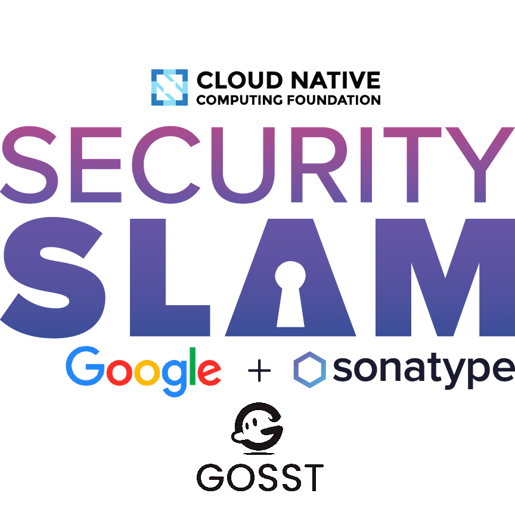

# Cloud Native Security Slam 2023

The Cloud Native Security Slam is a 30-day challenge designed to help creators and users of CNCF projects improve their software supply chain security at scale. Participants will have access to the Security Slam Library, which will include a curated list of topically organized articles and videos to help improve security posture. Success metrics and participation awards will be announced at the kickoff webinar, so be sure to sign up and join us for this exciting event!

Security Slam will culminate in an on-site award ceremony, where participants will be recognized and celebrated for their achievements. If you want to improve your software supply chain security and connect with other members of the CNCF community, the Security Slam is an event you won't want to miss!

  

## What is software supply chain security at scale?

Sonatype [defines]("https://www.sonatype.com/resources/software-supply-chain-management-part-1-what-is-a-software-supply-chain") the software supply chain as "anything that impacts this evaluation, production, and distribution" of software. Securing the software supply chain is a matter of creating safeguards on the supply chain, in order to reduce risk associated with the consumption of that software. Automation, when properly implemented through both generalized and specialized tooling, enables us to secure the software supply chain at scale.

As such, software supply chain security at scale is the process of safeguarding the evaluation, production, and distribution of software through means of automation.

We'll be diving deep into this in the Security Slam Library in the months leading up to the event. We will address this in a high level of detail, to help anyone from any industry see the value and practical next-steps— regardless of the maturity level of your project!

## End Users:

We are carrying your survey responses to projects to inform them of your expressed interest in security hygiene. There were so many responses that we needed to write a script to determine the weighted priority of each badge based on your interest— thanks for your participation!

Join our community to get updates from the event and access to the Security Slam Library– a compilation of resources to help your organization achieve supply chain security at scale.

## Maintainers & Contributors:

Join our [community]("https://community.cncf.io/cloud-native-security-slam/") to get access to the wealth of resources designed to help us secure our projects. Then register for our events to be eligible for prizes and benefit from the community momentum created by the month of hyper-focused security efforts!

### Awards

We announced today that participating projects qualify for exclusive swag and up to $500 in awards through the completion of 5 badges. Each badge is a topical set of goals that projects should complete during the event. 

The badges for the 2023 event are:

- [The Defender](defender.md)
- [The Chronicler](chronicler.md)
- [The Cleaner](cleaner.md)
- [The Mechanizer](mechanizer.md)
- [The Inspector](inspector.md)

## How effective is the Cloud Native Security Slam?

We've found that projects who participate in this event continue to deliver a higher level of security hygiene for up to a year following the event. We've recently released an analysis of the security hygiene data of the entire CNCF ecosystem, with a comparison between projects according to maturity as well as Slam participation.

What we learned is that when we measure the projects according to CNCF security standards, all projects all perform at notably lower levels if they did not participate in last year's slam. While Graduated projects perform slightly better than Incubating and Sandbox projects, there is still a markedly lower level of hygiene on average if they did not participate.

According to Sonatype's 8th Annual State of the Software Supply Chain Report [2022], this means that non-participating projects are statistically more likely to have critical vulnerabilities in their code.

Check out the stats in the Insights from the Cloud Native Security Slam presentation featured at Open Source Summit Europe
Review the Transparency Report from the 2022 Security Slam

